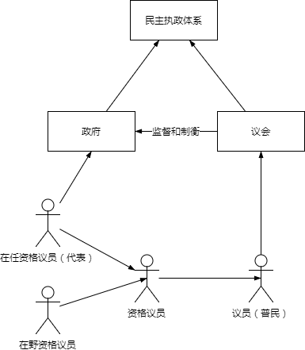

# 民主执政体系

民主执政体系

* 实现民主执政构建的一套体系，包括硬件、软件配置的整体环境，以及运作模式和流程。
* 是具体民主执政体系的基础，譬如统筹会府，立法会府。

特点：

* 具有明确的行业和区域管辖范围。
* 资格执政代替党派执政。

核心职能：

* 权力制衡
* 保证真实的民主执政
* 提高执政有效性，高效性，质量。

机构组成：

* 政府，进行代表执政的机构。
* 议会，进行普民执政的机构。

两者一体化，构建完整的民主执政体系。

## 政府

成员组成：议会选举的执政长官以及其任免的其他行政人员。

职能：在管辖范围内，实施代表执政。

## 议会

特点：

* 具有明确的行业和区域管辖范围。
* 以管辖范围配置议会议员。
* 具有投票方式的表决机制。

职能：

* 选举和弹劾政府长官。
* 监督政府。
* 实施普民执政。

配置：

* 场地
* 议员
* 平台

议员：

* 执政议员，属资格执政议员，当前在任的具备资格执政的公民。
* 在野议员，属资格执政议员，当前在野的具备资格执政的公民。
* 普民议员，未具备资格执政的公民。

从数量来讲，普民议员远大于资格执政议员, 普民执政有绝对制衡代表执政的能力。

## 代表选举

## 普民执政

## 代表执政