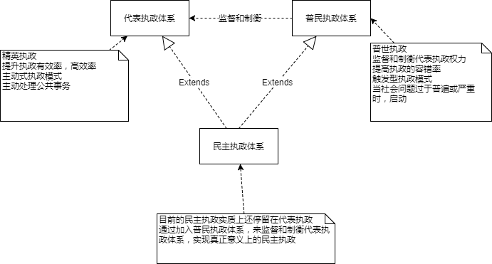

# 民主执政

由普民执政和代表执政并存的执政模式，实现真正意义的民主执政。

## 一、普民执政

普民执政，为了制衡代表执政，防止代表执政腐败，纠正代表执政错误；面对重大社会性问题，提高执政质量，降低执政风险。

普民执政的机制属于触发型执政模式。
* 普民，国家公民，亦包括代表。
* 普民执政权力高于代表执政
* 当社会性问题过于普遍时，触发普民执政；过于普遍的社会问题反映代表执政存在腐败的可能，或执政方向存在错误的可能。
* 当重大性社会性问题时，触发普民执政，让执政失败的风险分散，另一方面极大发挥集体智慧解决问题的能力。
* 普民执政可以大大降低游行、集会、罢工的现象。

## 二、代表执政

代表执政，为了提高执政的有效性、高效性，由议会选拔精英知识分子并授权权力，代理执政。

代表执政的机制属于主动型执政模式。
* 代表，为了提高执政的有效性、高效性，从民众之中选拔的精英知识分子；代表由议会选举，议会本身也属于民主体系。
* 代表执政权力低于普民执政权力

## 三、两者关系

* 普民执政与代表执政相互互补，实现真正意义上的民主执政。
* 普民执政由于权力、权限高于代表执政，可以监督并制衡代表执政。

## 四、如何制衡普民执政？

如果普民执政出现了腐败现象，混乱现象，意味着出现了民众意识分化或弱化的问题；也意味着遵法体系出现了问题。

## 五、必要条件

**信息时代的标志：IT技术**